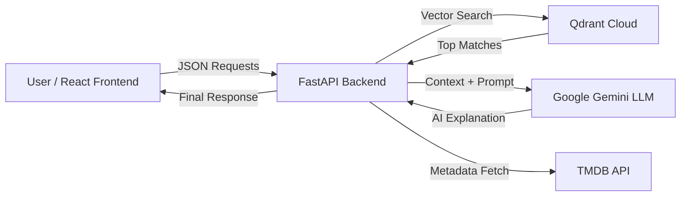

# ✨ Cine-AI: The Intelligent Movie Recommender


**Cine-AI** is a **production-ready, full-stack Generative AI application** that demonstrates how modern recommendation systems go beyond keywords using **semantic search, vector databases, and large language models**.

This project showcases **end-to-end GenAI system design**—from embedding pipelines and vector retrieval to **RAG (Retrieval-Augmented Generation)**, where **Google Gemini** acts as an AI movie critic to generate *explainable* recommendations.

> 🎯 **Built to highlight skills in:** Full-Stack Development, AI/ML Integration, Vector Databases, System Design, and Cloud Deployment.

---

## ⭐ Portfolio Highlights

* Designed and deployed a **semantic recommendation engine** using real-world movie data
* Implemented a **complete RAG pipeline** with grounding, retrieval, and LLM reasoning
* Integrated **Qdrant vector search** for millisecond-level similarity matching
* Built a **scalable FastAPI backend** with async endpoints
* Developed a **modern React UI** focused on UX, animations, and responsiveness
* Deployed a **cloud-native architecture** using Vercel, Render, and managed AI services

---

## 🚀 Features

* **🧠 Semantic Search** – Search movies using natural language (e.g., *"a mind-bending thriller about dreams"* → *Inception*).
* **🤖 RAG-powered Explanations** – AI-generated reasoning for every recommendation using Google Gemini.
* **🔗 Movie-to-Movie Similarity** – Discover "soulmate" movies based on plot-level similarity.
* **🔥 Real-time Trending** – Fetches the top 10 trending movies globally from TMDB.
* **🎨 Neon Glassmorphism UI** – Modern dark-mode UI with smooth animations and responsive design.
* **☁️ Cloud Native** – Easily deployable on Vercel, Render, Hugging Face Spaces, and Qdrant Cloud.

---

## 🏗️ Architecture

Cine-AI follows a **microservices-based architecture** with clear separation of concerns between frontend, backend, vector storage, and AI services.



---

## 🛠️ Tech Stack

### Frontend

* **Framework:** React (Vite)
* **Routing:** React Router v6
* **Styling:** Pure CSS3 (Glassmorphism, Grid, Animations)
* **Deployment:** Vercel

### Backend

* **Framework:** Python FastAPI
* **Embedding Model:** `all-MiniLM-L6-v2` (Sentence Transformers)
* **Vector Database:** Qdrant (Managed Cloud)
* **LLM:** Google Gemini 1.5 Flash
* **Deployment:** Render / Hugging Face Spaces

---

## ⚙️ Installation & Setup

### Prerequisites

* Node.js
* Python 3.9+
* API keys for **TMDB**, **Google Gemini**, and **Qdrant Cloud**

---

### 1️⃣ Backend Setup (FastAPI)

```bash
cd movie-backend

# Create virtual environment
python -m venv venv
source venv/bin/activate  # Windows: venv\Scripts\activate

# Install dependencies
pip install -r requirements.txt
```

Create a `.env` file:

```ini
TMDB_API_KEY=your_tmdb_key
GEMINI_API_KEY=your_gemini_key
QDRANT_URL=https://your-cluster.qdrant.tech
QDRANT_API_KEY=your_qdrant_key
```

Run the backend server:

```bash
uvicorn main:app --reload
```

---

### 2️⃣ Database Ingestion (Optional)

If starting with an empty Qdrant cluster, ingest movie embeddings:

```bash
python ingest.py
```

---

### 3️⃣ Frontend Setup (React)

```bash
cd client

# Install dependencies
npm install

# Start development server
npm run dev
```

---

## 🔌 API Endpoints

| Method | Endpoint     | Description                            |
| -----: | ------------ | -------------------------------------- |
|   POST | `/recommend` | Semantic search with AI explanation    |
|   POST | `/similar`   | Find movies similar to a given title   |
|    GET | `/trending`  | Fetch top 10 trending movies from TMDB |
|    GET | `/health`    | Health check endpoint                  |

---

## 🌐 Live Demo

🚀 **Frontend:** [https://cine-ai-vert.vercel.app/](https://cine-ai-vert.vercel.app/)
⚙️ **Backend API:** [https://jain-mayukh-movieback.hf.space](https://jain-mayukh-movieback.hf.space)

> ⚠️ *Note:* The backend may take a few seconds to wake up on first request due to free-tier hosting.

---

## 🧩 RAG Pipeline Explained

Cine-AI uses a **Retrieval-Augmented Generation (RAG)** pipeline to deliver both *accurate* and *explainable* movie recommendations.

### 1. Query Embedding

* User input is converted into a dense vector using **Sentence Transformers (`all-MiniLM-L6-v2`)**.
* This captures semantic meaning beyond keywords.

### 2. Vector Retrieval (Qdrant)

* The query vector is searched against movie plot embeddings stored in **Qdrant Cloud**.
* Top-K semantically similar movies are retrieved with similarity scores.

### 3. Context Construction

* Retrieved movie metadata (title, plot, genre, score) is compiled into a structured context.
* This context acts as *grounded knowledge* for the LLM.

### 4. LLM Reasoning (Google Gemini)

* Context + user query are sent to **Gemini 1.5 Flash**.
* Gemini generates a human-like explanation justifying *why* each movie matches the request.

### 5. Final Response

* The backend merges similarity scores, metadata, and AI explanations.
* A clean JSON response is sent to the frontend.

---

## ⚡ Performance & Scaling

Cine-AI is designed for **low-latency inference** and **horizontal scalability**.

### 🚀 Performance Optimizations

* **Precomputed Embeddings:** All movie plots are embedded offline to avoid runtime overhead.
* **Fast Vector Search:** Qdrant enables millisecond-level nearest-neighbor search.
* **Lightweight LLM Calls:** Gemini Flash is used for fast, cost-efficient reasoning.
* **Async FastAPI:** Non-blocking request handling for high concurrency.

### 📈 Scalability Strategy

* **Stateless Backend:** Easily scalable across multiple instances.
* **Managed Vector DB:** Qdrant Cloud auto-scales with dataset size.
* **Frontend CDN:** Deployed on Vercel with global edge caching.
* **Future Enhancements:**

  * Redis caching for repeated queries
  * Batch embedding updates
  * User-personalized recommendation vectors

---

## 📸 Screenshots

*Add screenshots of the following views:*

* Home Page
.png)

* Search Results
.png)
.png)

* Trending Movies
.png)

.png)


---

## 🤝 Contributing

Contributions are welcome! 🚀

1. Fork the repository
2. Create your feature branch (`git checkout -b feature/AmazingFeature`)
3. Commit your changes (`git commit -m 'Add AmazingFeature'`)
4. Push to the branch (`git push origin feature/AmazingFeature`)
5. Open a Pull Request

---

## 📄 License

This project is distributed under the **MIT License**. See the `LICENSE` file for more information.

---

## 👤 Author

**Mayukh Jain**
🔗 [LinkedIn](www.linkedin.com/in/mayukh-jain-b4732128a) | 💻 [GitHub](https://github.com/Mayukh-Jain)
